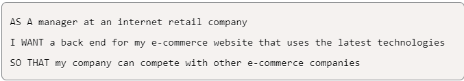

# **Welcome to my E-commerce Store!**

#

### *Description:*

**Here you can find back-end code for an e-commerce site. I took a working Express.js API and configured it to use Sequelize to interact with a MySQL database in place**

#

### *USER STORY:*

#

### *Demonstration of Application*

#

### *Technologies Used:*

#

#### *References*

- **[The Coding Boot Camp of UT-Austin](https://techbootcamps.utexas.edu/coding/)**

#

#### *Author*

**Charles Breven Glasgow**

- **[GitHub](https://github.com/Brevenn)**
- **[LinkedIn](https://www.linkedin.com/in/charles-glasgow-7b07a41a3/)**

#